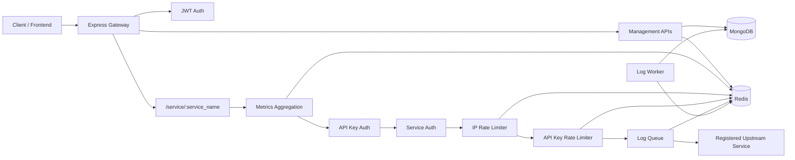

# API-Pulse

API-Pulse is a Node.js API gateway and API management backend. It lets users register upstream microservices, generate API keys, route traffic through a protected gateway, apply Redis-backed rate limits, collect request logs, and expose operational analytics for users, services, and API keys.

## Features

- User registration, login, logout, and JWT cookie authentication
- API key creation, listing, and revocation
- Per-user service registration and service lookup
- Gateway proxy endpoint for registered services
- API-key and IP-based rate limiting with Redis
- Request logging through a Redis queue and MongoDB log storage
- Redis-backed metrics for requests, latency, errors, status codes, and rate limits
- Sandbox endpoint for testing external HTTP requests
- Docker support for the backend and Redis

## Tech Stack

- **Runtime:** Node.js with ES modules
- **Server:** Express
- **Proxy:** `http-proxy-middleware`
- **Database:** MongoDB with Mongoose
- **Cache / queue / metrics:** Redis with ioredis
- **Authentication:** JWT, bcrypt, HTTP-only cookies
- **HTTP client:** Axios
- **Deployment:** Docker and Docker Compose

## Architecture



The main entry point is `gateway-service/index.js`. It creates the Express app, connects to MongoDB, starts the background log worker, registers management routes, and mounts the gateway proxy route at:

```text
/service/:service_name
```

Traffic sent to that route is resolved against the authenticated user's registered service records. After the service is found, the gateway rewrites the path and forwards the request to the service URL stored in MongoDB.

## Request Flow

For proxied API traffic, the middleware chain is:

1. `aggregation` attaches response-finish metrics collection.
2. `keyauth` validates the `x-api-key` header against hashed API keys in MongoDB.
3. `serviceauth` verifies that the requested service belongs to the API key owner.
4. `ipRateLimiter` tracks per-IP request counts in Redis.
5. `apikeyRateLimiter` tracks per-key request counts in Redis.
6. `LogController` pushes request metadata into a Redis log queue.
7. `http-proxy-middleware` forwards the request to the upstream service.

The log worker in `gateway-service/worker.js` periodically drains `queue:logs` from Redis and writes batches into the `Log` MongoDB collection.

## Project Structure

```text
API-Pulse/
├── gateway-service/
│   ├── index.js                         # Express app, routes, proxy setup
│   ├── worker.js                        # Redis log queue flusher
│   ├── db/
│   │   ├── connectDB.js                 # MongoDB connection
│   │   ├── Redis.js                     # Redis client
│   │   ├── controllers/                 # Route handlers
│   │   ├── middlewares/                 # Auth, service auth, aggregation
│   │   └── models/                      # Mongoose models
│   ├── middlewares/                     # Gateway auth, logging, rate limits
│   ├── micro-services/                  # Example upstream service
│   └── routes/routes.json               # Example static service config
├── docker-compose.yml                   # Backend + Redis
├── Dockerfile                           # Backend image
├── package.json                         # Scripts and dependencies
└── testredis.js                         # Redis connectivity test
```

## Data Model Overview

- `User`: stores user credentials, refresh token, and JWT helper methods.
- `Service`: stores a user's registered upstream service name and URL.
- `apikey`: stores hashed API keys, tier, owner, active state, and request count.
- `Log`: stores request logs flushed from the Redis queue.
- `RequestHistory`: stores sandbox request history for each user.

## API Overview

### Authentication

| Method | Endpoint | Description |
| --- | --- | --- |
| `POST` | `/register` | Create a user account. |
| `POST` | `/login` | Authenticate a user and set access/refresh cookies. |
| `POST` | `/logout` | Clear the authenticated user's session. |
| `GET` | `/loginstatus` | Check whether a refresh token is present and valid. |
| `GET` | `/userdata` | Return the authenticated user's username and email. |

### Service Management

| Method | Endpoint | Description |
| --- | --- | --- |
| `POST` | `/register-service` | Register an upstream service for the logged-in user. |
| `POST` | `/edit-service` | Update service name, URL, or active state. |
| `POST` | `/delete-service` | Delete a registered service. |
| `GET` | `/services` | List services owned by the logged-in user. |

### API Keys

| Method | Endpoint | Description |
| --- | --- | --- |
| `POST` | `/create-api-key` | Create a new API key. The raw key is returned once. |
| `POST` | `/revoke-api-key` | Mark an API key as inactive. |
| `GET` | `/api-keys` | List the authenticated user's API keys. |

### Gateway Proxy

| Method | Endpoint | Description |
| --- | --- | --- |
| `ANY` | `/service/:service_name/*` | Proxy a request to a registered upstream service. Requires `x-api-key`. |

Example:

```bash
curl http://localhost:3000/service/user-service/users \
  -H "x-api-key: YOUR_API_KEY"
```

If `user-service` is registered with URL `http://localhost:3001`, the gateway forwards the request to:

```text
http://localhost:3001/users
```

### Logs and Metrics

| Method | Endpoint | Description |
| --- | --- | --- |
| `GET` | `/userLogs` | Return recent logs for the authenticated user. |
| `GET` | `/serviceLogs/:service_name` | Return recent logs for a service. |
| `GET` | `/apikeyLogs/:apikeyId` | Return recent logs for an API key. |
| `GET` | `/metrics/user` | Return current user metrics. |
| `GET` | `/metrics/userhourlyrequests` | Return today's hourly request counts for the user. |
| `GET` | `/metrics/service/:service_name` | Return current metrics for a service. |
| `GET` | `/metrics/servicehourlyrequests/:service_name` | Return today's hourly service request, latency, and error data. |
| `GET` | `/metrics/servicedailymetrics/:service_name` | Return seven-day service request, latency, and error data. |
| `GET` | `/metrics/apikey/:apikeyId` | Return current metrics for an API key. |
| `GET` | `/metrics/apikeyhourlymetrics/:apikeyId` | Return today's hourly API-key request, latency, and error data. |
| `GET` | `/metrics/apikeydailymetrics/:apikeyId` | Return seven-day API-key request, latency, and error data. |

### Sandbox and Health

| Method | Endpoint | Description |
| --- | --- | --- |
| `POST` | `/sandbox` | Send a test HTTP request and store request history. |
| `GET` | `/sandbox/recent-requests` | Return recent sandbox requests. |
| `GET` | `/health` | Return gateway health, uptime, and timestamp. |

## Environment Variables

Create a `.env` file in the project root. The application expects these values:

```env
PORT=3000
FRONTEND_URL=http://localhost:5173
MONGO_URI=mongodb://localhost:27017/api-pulse
REDIS_URL=redis://localhost:6379
ACCESS_TOKEN_SECRET=replace_with_access_token_secret
REFRESH_TOKEN_SECRET=replace_with_refresh_token_secret
ACCESS_TOKEN_EXPIRY=1d
REFRESH_TOKEN_EXPIRY=10d
```

When running with Docker Compose, Redis is provided by the `redis` service. In that case, use:

```env
REDIS_URL=redis://redis:6379
```

MongoDB is not included in the current `docker-compose.yml`, so `MONGO_URI` must point to a reachable MongoDB instance.

## Getting Started

### Prerequisites

- Node.js 20+
- MongoDB
- Redis
- npm

### Local Development

Install dependencies:

```bash
npm install
```

Start MongoDB and Redis, then run the gateway:

```bash
npm run dev
```

The gateway runs on `http://localhost:3000` by default.

### Production Start

```bash
npm start
```

### Docker

Build and start the backend with Redis:

```bash
docker compose up --build
```

The backend container exposes port `3000`, and Redis exposes port `6379`.

## Example Upstream Service

The repository includes a small sample service at:

```text
gateway-service/micro-services/user-service.js
```

It listens on port `3001` and exposes:

- `GET /users`
- `POST /create_user`

You can run it in a separate terminal:

```bash
node gateway-service/micro-services/user-service.js
```

Then register it through `/register-service` with:

```json
{
  "service_name": "user-service",
  "url": "http://localhost:3001"
}
```

## Notes

- API keys are generated as random values, hashed with SHA-256, and stored in MongoDB. The raw key is only returned when it is created.
- The gateway expects client API requests to send the raw key in the `x-api-key` header.
- Metrics are stored in Redis with hourly, daily, and global keys. Hourly metrics expire after one day, while daily/global metrics expire after seven days.
- Request logs are first queued in Redis, then written to MongoDB by the background worker.
- The project currently does not define an automated test suite; `npm test` is a placeholder script.
